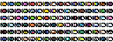

# Fishtude 🎣

## Fish 🐟

## Passives 🔥

| Passive                                                                           | Effect                     |
|-----------------------------------------------------------------------------------|----------------------------|
|  | + fish spawn quatity       |
|  | + fish spawn time decrease |
|  | + fish gold base           |
|  | + fish gold multiplier     |
|  | + gold passive income      |

## Development 👨‍💻

- [X] Player
    - [X] Movement
    - [X] Fishing
    - [X] Gold
    - [X] Skill-Tree

- [X] Fish
    - [X] Movement
        - [X] Default
        - [X] Wave
        - [X] Back
        - [X] Wave-Back

- [ ] Game
    - [ ] Main-Menu 
    - [ ] Save
    - [ ] Music/Sound

## License 📜

- [fishtude](https://github.com/FelipeIzolan/fishtude) - The Unlicensed
- [c-vector](https://github.com/eteran/c-vector) - MIT
- [SDL2](https://github.com/libsdl-org/SDL) - Zlib
